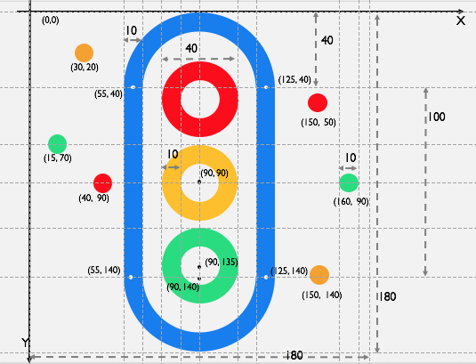
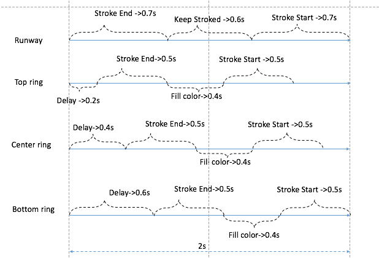
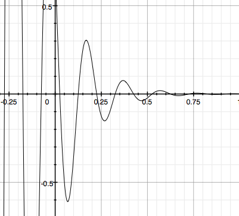

# HLTrafficLightsIndicatorView

[](http://cocoapods.org/pods/HLTrafficLightsIndicatorView)
[](http://cocoapods.org/pods/HLTrafficLightsIndicatorView)
[](http://cocoapods.org/pods/HLTrafficLightsIndicatorView)

## Example

### Result


### Layers


### Timeline


### Vibration for runway layer


In iOS9 Apple finally made the ```CASpringAnimation``` class public, we can simplly create an attractive spring animation effecting CALayer. But our indicator view must be compatible with iOS8+. To archive the subtle effects for runway layer, we should dig out little physics knowledge, that is the Vibration. 

Pls check reference bellow:

- [vibration wikipedia](https://zh.wikipedia.org/zh-cn/%E6%8C%AF%E5%8A%A8#.E9.98.BB.E5.B0.BC.E6.8C.AF.E5.8A.A8)
- [vibration in HLTrafficLightsIndicatorView](https://github.com/pandaApe/HLTrafficLightsIndicatorView/blob/master/HLTrafficLightsIndicatorView/Classes/HLTrafficLightsIndicatorView.swift#L305)

## Requirements
- Swift 3.0
- iOS 8.0+
- Xcode 8.0

## Installation

HLTrafficLightsIndicatorView is available through [CocoaPods](http://cocoapods.org). To install
it, simply add the following line to your Podfile:

```ruby
pod "HLTrafficLightsIndicatorView"
```

## Usage example

Inited from pure code ：

```swift
let view = HLTrafficLightsIndicatorView(frame: CGRect(x: 100, y: 100, width: 200, height: 200))
        
self.view.addSubview(view)
        
```
### Customization Properties

```swift

open var topRingColor        = UIColor.red
open var centerRingColor     = UIColor(red: 255/255, green: 192/255, blue: 1/255, alpha: 1)
open var bottomRingColor     = UIColor(red: 18/255, green: 222/255, blue: 125/255, alpha: 1)
open var runwayColor         = UIColor(red: 6/255, green: 122/255, blue: 240/255, alpha: 1)

open var duration: Double = 1.2 
```    

## ~~TODO~~
~~The runway layer need enable spring animation.~~

## Author

pandaApe, whailong2010@gmail.com

## License

HLTrafficLightsIndicatorView is available under the MIT license. See the LICENSE file for more info.
